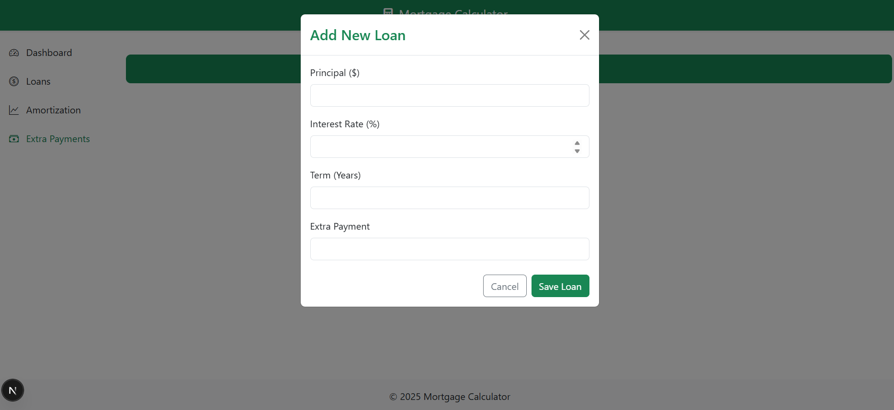

# 🧾 Mortgage Loan Calculator


A complete Mortgage Loan Calculator system for Laravel applications with API endpoints.

## ✨ Features

- **REST API** - Full CRUD operations
- **Soft Deletes** - Archive instead of delete
- **Validation** - Dedicated request classes
- **Testing** - test coverage
- 
### Requirements
- PHP 8.1+
- Laravel 12
- Database (SQLite)

<<<<<<< HEAD
```bash 
composer install
=======
```bash
>>>>>>> 9a58d4b74e4ec248ba4a5dfd3aa7725f2c9754cd
php artisan migrate
php artisan serve

cd front-end
npm run dev

Backend URL: http://127.0.0.1:8000
Frontend URL: http://localhost:3000

## License

The Laravel framework is open-sourced software licensed under the [MIT license](https://opensource.org/licenses/MIT).
